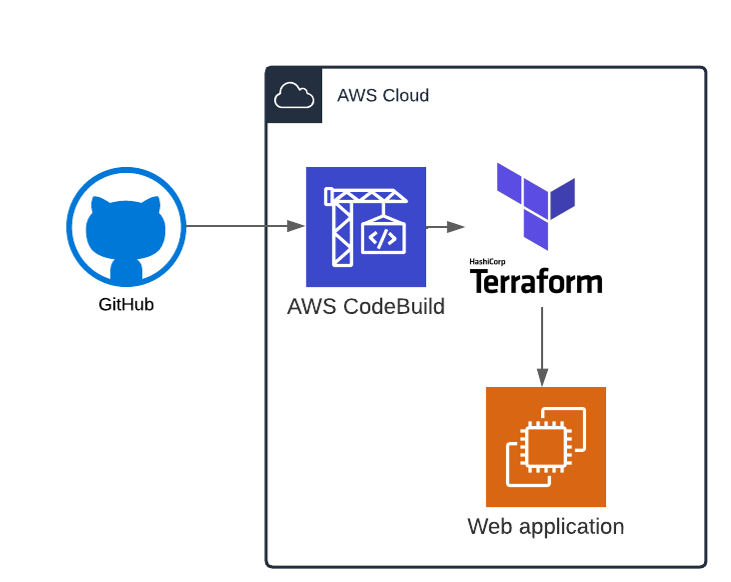

CI/CD Project to automatically apply Terraform with AWS codeBuild.
Project development stages:
-	Create codebuild job to automatically apply automatically apply terraform script whenever you commit a change to the GitHub repository.
-	Create IAM user with programmatic access
-	Create shell scripts and buildspec.yaml file
-	Create personal access token to authenticate codebuild job and my github.
-	Store Terraform state file in my S3 bucket.
 

Technologies used in this project:
-	Cloud provider: AWS
-	Infrastructure as a code: Terraform
-	AWS CodeBuild
-	Bash scripting
